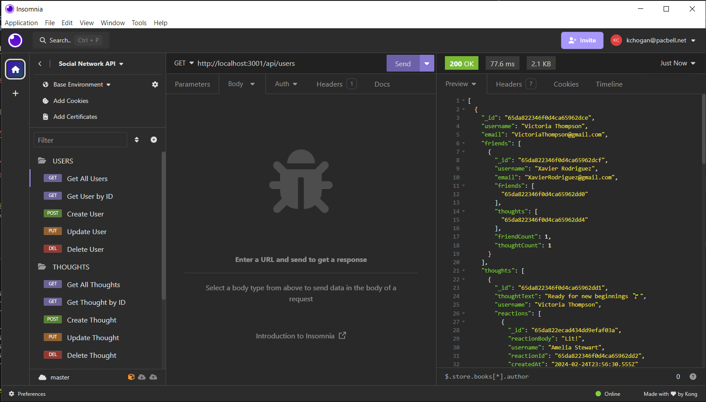

# Social Network API

[](https://opensource.org/licenses/MIT)

## Description
An API for a social network web application where users can share their thoughts, react to friends’ thoughts, and create a friend list.  

## Table of Contents

- [Installation](#installation)
- [Usage](#usage)
- [Credits](#credits)
- [License](#license)
- [How to Contribute](#guidelines)
- [Tests](#tests)
- [Questions](#questions)

## Installation

After cloning the repo
- Type 'npm install'
- Type 'npm seed' to populate the db

## Usage

- Type 'npm start' to run the application
- Use a browser, cURL, or a third party app (e.g. Insomnia) to run routes for GET, POST, PUT, and DELETE routes:
   - Users
        - Return all users: GET: http://localhost:3001/api/users/
        - Return a single user: GET: http://localhost:3001/api/users/:userId
        - Create a user: POST: http://localhost:3001/api/users/
            ```json
            {
                "username": "<username string>",
                "email": "<email string>"
            }
            ```
        - Update a user: POST: http://localhost:3001/api/user/:userId
        - Delete a user: DELETE: http://localhost:3001/api/user/:userId
    - Thoughts
        - Return all thoughts: http://localhost:3001/api/thoughts
        - Return a single thought: GET: http://localhost:3001/api/thoughts/:thoughtId
        - Create a thought: POST: http://localhost:3001/api/thoughts/:userId
            ```json
            {
                "thoughtText": "<thought string>"
            }
            ```
        - Update a thought: POST: http://localhost:3001/api/thoughts/:thoughtId
        - Delete a thought: DELETE: http://localhost:3001/api/thoughts/:thoughtId
    - Friends
        - Add a friend: POST: http://localhost:3001/api/users/:userId/friends
            ```json 
            {
                "_id": "<friend's user _id>"
            }
            ```
        - Delete a friend: DELETE: http://localhost:3001/api/users/:userId/friends/:friendId
    - Reactions
        - Add a reaction: POST: http://localhost:3001/api/thoughts/:thoughtId/reactions
            ```json 
            {
                "reactionBody": "<reaction string>",
                "username": "<username string>"
            }
            ```
        - Delete a reaction: DELETE: http://localhost:3001/api/thoughts/:thoughtId/reactions/:reactionId
- Repo includes and Insomnia.JSON that contains all of the relevant API calls



[Demo Video](https://youtu.be/ZhuGKlcfDqw)

## Credits

* Node.js Copyright [OpenJS Foundation](https://openjsf.org/) and Node.js contributors. All rights reserved. 
* Insomnia Copyright © 2024 Kong Inc. All Rights Reserved.
* Express.js Copyright © 2017 StrongLoop, IBM, and other expressjs.com contributors.
* Mongoose Copyright © 2010 [LearnBoost](dev@learnboost.com)

## License

This application is covered under the MIT License.

[](https://opensource.org/licenses/MIT)

<a id="guidelines"></a>
## How To Contribute

N/A

## Tests

N/A

## Questions

[GitHub Profile](https://github.com/kevinchogan)

For questions, please contact kchogan@pacbell.net.
